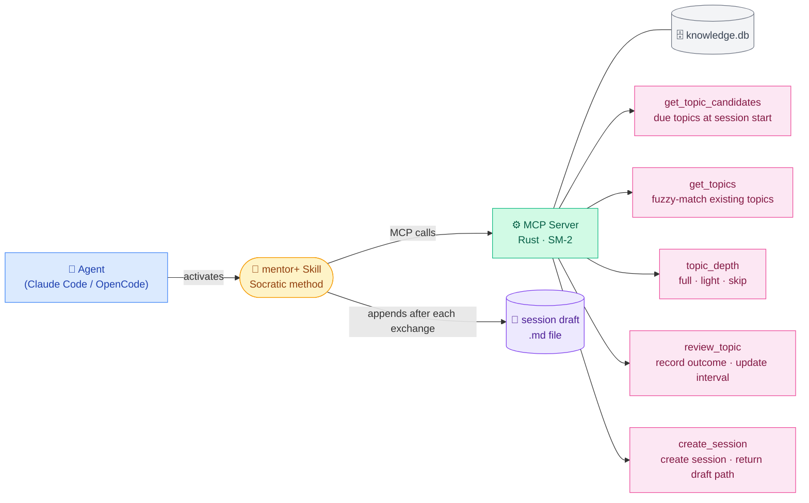
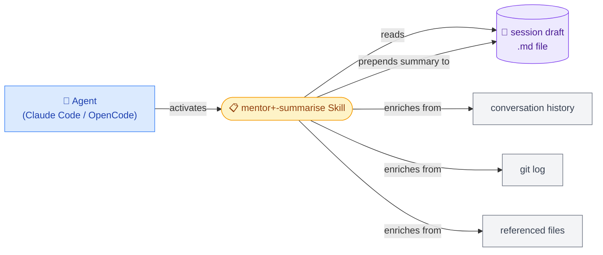
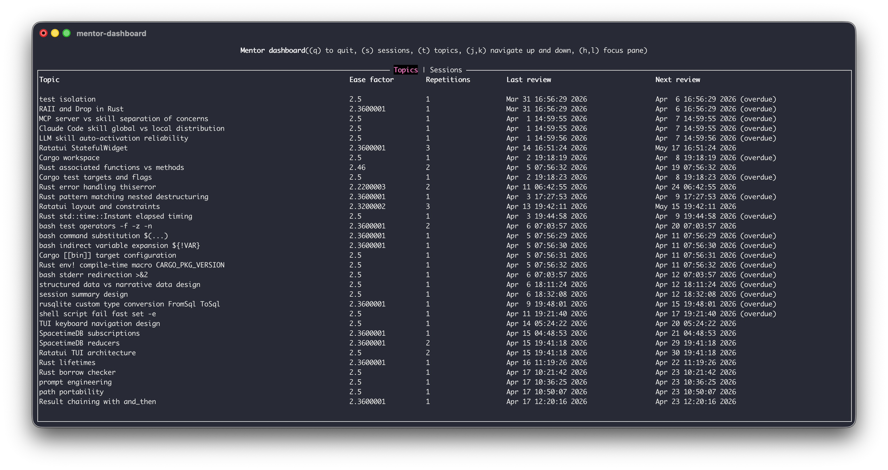
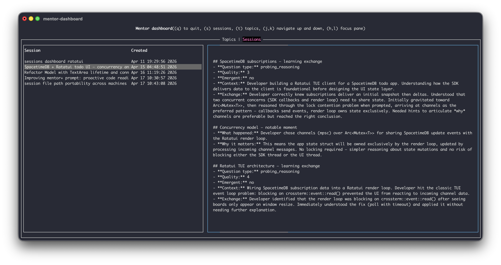

# mentor-plugin

Turns your coding agent into a Socratic mentor for learning projects — with spaced repetition knowledge tracking built in.

Instead of handing you answers, the agent guides you with questions, hints, and explanations — building real understanding rather than dependency. It remembers what you know and what you struggle with across sessions, adjusting how hard it pushes you on each topic.

Once enabled, mentor mode is **always on** for that session. The agent will never hand you solutions — it will guide you to find them yourself.

---

## What it does

- Guides with questions instead of answers
- At session start, checks your knowledge level per topic and adjusts questioning depth accordingly
- Records learning outcomes after each meaningful exchange
- Surfaces topics due for review at the start of each session
- Writes a running draft file during the session capturing every learning exchange and notable moment
- On demand, generates a structured end-of-session summary prepended to the draft

---

## How it works

A few components wire together when installed: 
- a **skill** (mentor+) to shapes how the agent teaches
- an **MCP server** that tracks what you know.
- a **skill** (mentor+summarise) to summarise your session

### mentor+



### mentor+summarise



---

## Supported coding agents

| Agent | Support |
|---|---|
| [Claude Code](https://claude.ai/code) | ✓ |
| [OpenCode](https://opencode.ai) | ✓ |

Both macOS and Linux are supported.

→ **[Installation instructions](./INSTALLATION.md)**

---

## Usage

### Starting a session

#### Claude Code
```
/mentor+
```

#### OpenCode
Run `/skills` and select `mentor+`.

---

### Ending a session

When you're done, generate a structured summary of what was learned:

#### Claude Code
```
/mentor+summarise
```

#### OpenCode
Run `/skills` and select `mentor+summarise`.

The summariser reads the session draft file and prepends a structured summary covering what was learned, what was struggled with, and what was built.


## Dashboard 
You can also visualise your historical topics and sessions to see your progress.

See [Installation](./INSTALLATION.md#dashboard) for more details




---


## Developer
Documentation about how this project works internally
[Developer](./DEVELOPER.md)

## License

MIT
