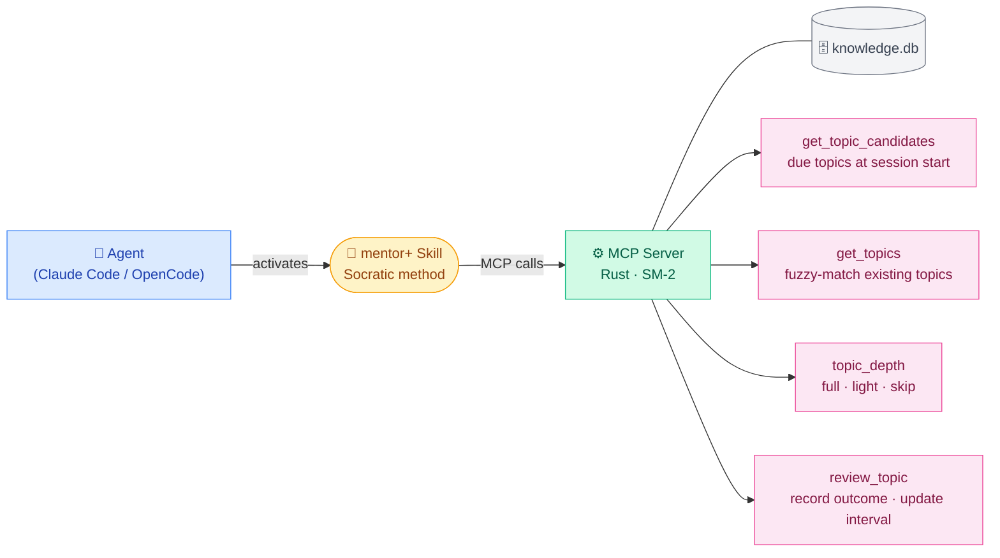

# mentor-plugin

Turns your coding agent into a Socratic mentor for learning projects — with spaced repetition knowledge tracking built in.

Instead of handing you answers, the agent guides you with questions, hints, and explanations — building real understanding rather than dependency. It remembers what you know and what you struggle with across sessions, adjusting how hard it pushes you on each topic.

Once installed, mentor mode is **always on** for that project. The agent will never hand you solutions — it will guide you to find them yourself.

---

## What it does

- Guides with questions instead of answers
- At session start, checks your knowledge level per topic and adjusts questioning depth accordingly
- Records learning outcomes after each meaningful exchange
- Surfaces topics due for review at the start of each session

---

## How it works

Two components wire together when installed: a **skill** that shapes how the agent teaches, and an **MCP server** that tracks what you know.



---

## Supported agents

| Agent | Support |
|---|---|
| [Claude Code](https://claude.ai/code) | ✓ |
| [OpenCode](https://opencode.ai) | ✓ |

Both macOS and Linux are supported.

→ **[Installation instructions](./INSTALLATION.md)**

---

## Usage

### Claude
Just use this command to start the session
```/mentor+```

### Opencode
Search for skills
```/skills```

Select mentor+

---

## License

MIT
