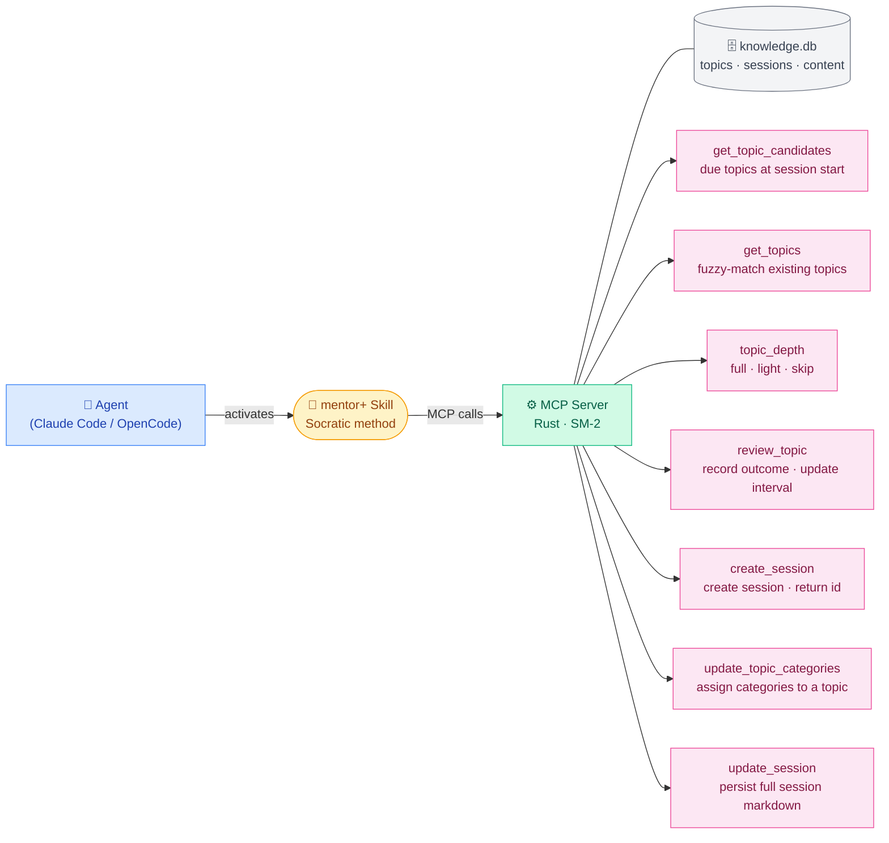
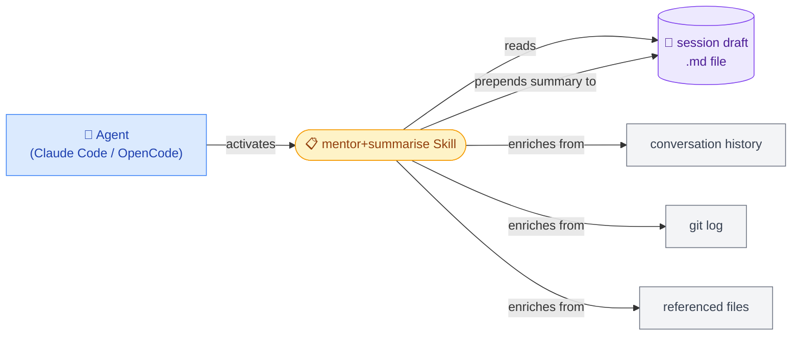
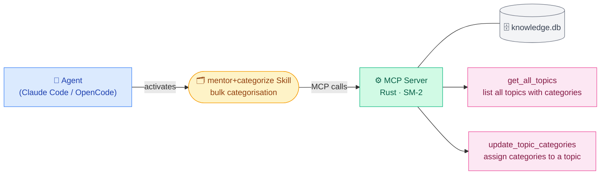

# mentor-plugin

Turns your coding agent into a mentor for learning projects — with spaced repetition knowledge tracking built in.

Instead of handing you answers, the agent guides you with questions, hints, and explanations — building real understanding rather than dependency. It remembers what you know and what you struggle with across sessions, adjusting how hard it pushes you on each topic.

---

## What it does

- Selects the right teaching method based on your prior knowledge and the type of thing you're learning
- At session start, checks your knowledge level per topic and adjusts accordingly
- Records learning outcomes after each meaningful exchange
- Surfaces topics due for review at the start of each session
- Tracks every learning exchange and notable moment during the session
- On demand, generates a structured end-of-session summary

---

## Two mentor skills

### mentor+
The original Socratic mentor. Always starts with questions, guides you to answers through dialogue, and falls back to direct teaching only when you're genuinely stuck. Best for exploring concepts through conversation.

### mentor+flow
An adaptive mentor that selects the teaching method based on two signals: your prior knowledge level (from SM-2) and the type of knowledge the topic requires (procedural, structural, or declarative).

Rather than applying one method to everything, it:
- **Scopes** what you want to learn and what outcome you're after
- **Plans** a sequence of sub-topics for compound subjects (e.g. UDP hole punching)
- **Calibrates** your prior knowledge per sub-topic
- **Executes** the right method — worked examples for new procedural topics, Socratic for familiar declarative ones, guided design for architecture, retrieval practice for mastered skills

The teaching methods are grounded in cognitive science research. See [TEACHING.md](./TEACHING.md) for the research foundation.

---

## How it works

A few components wire together when installed:
- a **skill** (mentor+ or mentor+flow) that shapes how the agent teaches
- an **MCP server** that tracks what you know
- a **skill** (mentor+summarise) to summarise your session
- a **skill** (mentor+categorize) to organise your topics by knowledge domain

### mentor+ and mentor+flow



### mentor+summarise



### mentor+categorize



---

## Supported coding agents

| Agent | Support |
|---|---|
| [Claude Code](https://claude.ai/code) | ✓ |
| [OpenCode](https://opencode.ai) | ✓ |

Both macOS and Linux are supported.

→ **[Installation instructions](./INSTALLATION.md)**

---

## Usage

### Starting a session

#### Claude Code
```
/mentor+
```
or
```
/mentor+flow
```

#### OpenCode
Run `/skills` and select `mentor+` or `mentor+flow`.

---

### Categorising topics

Run this on demand to assign knowledge domain categories to all your topics. The skill proposes a categorisation, asks for confirmation, then saves.

#### Claude Code
```
/mentor+categorize
```

#### OpenCode
Run `/skills` and select `mentor+categorize`.

---

### Ending a session

When you're done, generate a structured summary of what was learned:

#### Claude Code
```
/mentor+summarise
```

#### OpenCode
Run `/skills` and select `mentor+summarise`.

The summariser reads the session draft file and prepends a structured summary covering what was learned, what was struggled with, and what was built.


## Dashboard 
You can also visualise your historical topics and sessions to see your progress.

See [Installation](./INSTALLATION.md#dashboard) for more details


---


## Developer
Documentation about how this project works internally
[Developer](./DEVELOPER.md)

## License

MIT
